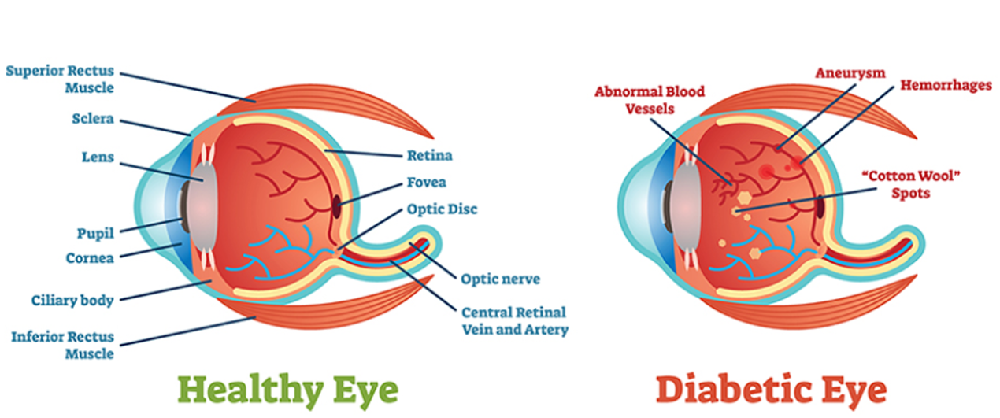
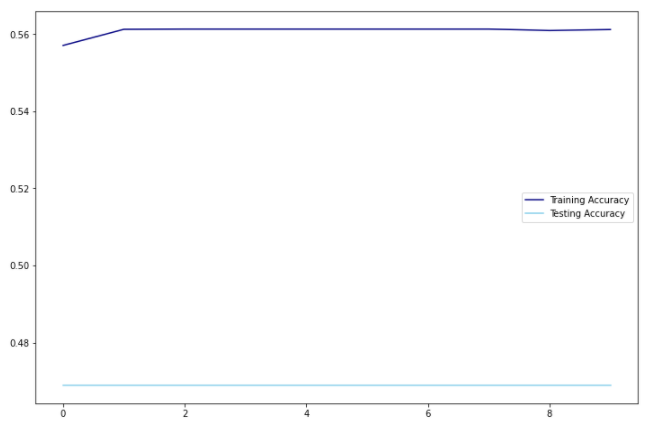
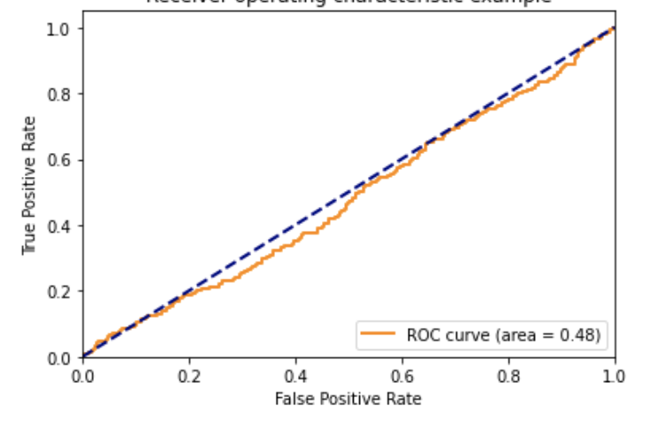
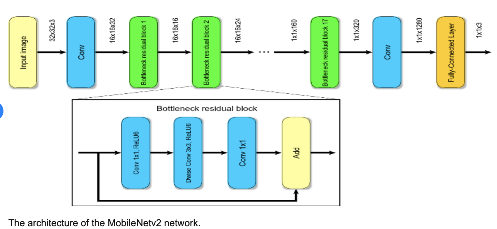
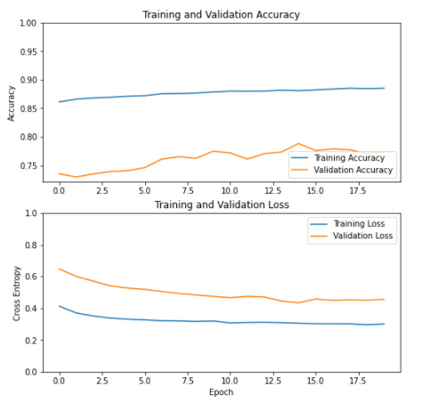
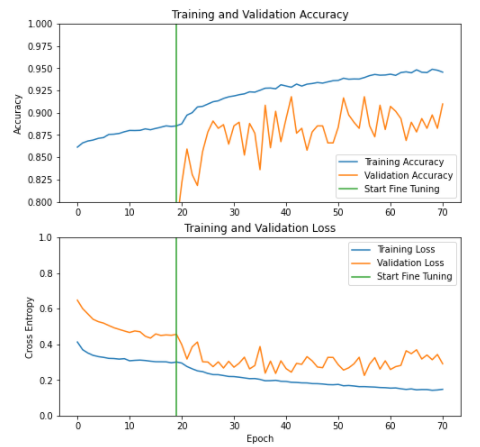
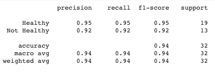
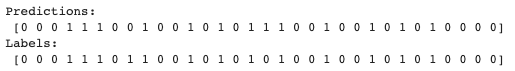

# Diabetic Retinopathy Detection

## Executive Summary

Diabetes is the leading cause of new cases of blindness in adults, it causes a disease of the eye called diabetic retinopathy (DR). As diabetic population increases, the number of people with impaired vision increases. if it is not detected and treated in a timely manner, vision can be damaged permanently.

This project is designed to detect retinopathy in a diabetic eye. The goal is to leverage deep learning technology to create models and generate the detection as oppose to manual detection done by a licensed doctor. Due to numerous inventions and studies in image detection models, this project will use 2 models and share the results in the following class categories:
0 - healthy eye
1 - non-healthy eye

Also, in this process - would like to strengthen my knowledge in deep neural networks and cutting-edge technology on image detection models. My hope is to continue to make an impact with the progress made during this project scope.

## Table of Contents

1. Problem Statement
2. Overview
3. Methodology
4. CNN
5. Transfer Learning Model
6. Next Steps
7. Conclusion
8. Resources

## 1. Problem Statement

Can I use image recognition models to detect diabetic retinopathy?

Diabetic Retinopathy is the most common diabetic eye disease and can lead to vision loss.  

Early detection, timely treatment, can help reduce the severity of the disease.

## 2. Overview

Diabetic retinopathy is characterized by progressive damage to the blood vessels of the retina. It progresses through four stages - Mild, Moderate, Severe and Proliferative. Due to the nature of mild and slow progression in the disease, the images from no disease to mild do not show great visual difference. Hence, the scope of this project is narrowed down to 2 classes – healthy eye and non-healthy eye (diseased eye).

Diseased eye can show few dot hemorrhages and microaneurysms, and soft and hard exudates to massive hemorrhages and are included in the diseased eye labeled set.

## 3. Methodology

#### 1. Datasets:

The datasets used are from Kaggle, contained un-balanced classes in all categories. Although there were 25k in no disease category, other categories had way less images to work with.  

I noticed every image had 2 sets – left and right. When analyzed further – noticed an image with left is labeled in Mild and the same image with right is labeled with Severe. After careful evaluation, I decided to consider only pairs into each label. Due to the noise in the labels, the final dataset for binary class reduced further.

Here are the counts:

1.	No diabetic retinopathy labeled images (Healthy category class) - 8857
2.	Moderate, Severe and Proliferative labeled images ( Not-healthy category class) - 1345

#### 2. Data Augmentation

Used Keras preprocessing and data augmentation to perform augmentations:
-	Flips
-	Shear
-	Rotation
-	Brightness
To increase the dataset size and feed to the models

#### 3. CNN Model

To quickly evaluate the scope, created basic CNN model and learnt that multiclass classification requires careful evaluation and collection of more images in different stages of the disease.

Moved to binary classification with total of 9741 images in training set and 892 in validation set.

#### 4. Transfer Learning Model

Leverages Transfer learning process to use pre-trained model MobileNet V2 that allows us to feature extract and compile the model and fine tune the model with additional trainable parameters.
It achieves competitive accuracy with significantly fewer parameters and smaller computational complexity.

## 4. CNN 

Started with simple CNN layer model and with 9741 training set of images, reduced to 640 by 640 to test on the model

1. Images original set - 9741 training set, 892 validation set
2. Preprocessing and Augmentation - Using Keras
3. CNN - 8-layer model with 85M trainable parameters

Our CNN baseline was 0.4 accuracy and with above additional parameters performed at 0.5 accuracy.

#### Below are the metrics and predictions from CNN:

1. Training 0.51% and validation at 0.4%

2. AUC/ROC score is at 0.48

Since our AUC is less then 0.5 , the model has no discrimination capacity to distinguish between positive class and negative class.

When looked at training and validation accuracy – we can see that it performed very poor on our data. There could be many reasons. May be our model is not complex enough to learn the underlying patterns of images or may be the training data is too small to accurately generalize across classes.

## 5. Transfer Learning with MobileNetV2

Transfer learning is a technique of reuse of the pre-trained model on a new task, a machine exploits the knowledge gained from a previous task to improve generalization about another. We can take advantage of these learned feature maps without having to start from scratch by training a large model on a large dataset.

Base model is from MobileNet V2 developed at Google, it is trained on ImageNet dataset consisting of 1.4 M images and 1000 classes. It uses the bottleneck layer for feature extraction as it retains more generality as compared to the final/top layer.

We will try two ways to customize a pretrained model:

1.	Feature Extraction:
When working with a small dataset, it is beneficial to take advantage of features learned by a model trained on a larger dataset in the same domain. This is done by instantiating the pre-trained model and adding a fully connected classifier on top.
The pre-trained model is frozen and only the weights of the classifier get updated during training. The convolutional base extracted all the features associated with each image and just trained a classifier that determines the image class given that set of extracted features.

2.	Fine Tuning:
To further improve performance, can repurpose the top-level layers of the pre-trained models to the new dataset via fine tuning. In this case, tuned weights such that model learned high-level features specific to the dataset.

Workflow used:
1. Examine the original data to ensure proper labeling has been done with the image set. Separated sets for train, validation and test. Training set of 10217, Test set of 892
2. Build a pipeline, Keras ImageDataGenerator for preprocessing, augmentation, rescaling as the model expects in format [1,1]
3. Compose the model - load pretrained base model and weights built on ImageNet with 154 layers, allowing options to unfreeze top layers, allows the images to be exported as 8x8x1280 block features
4. Train the model - learning rate 0.0001, trainable parameters of 1281 using objects variables weigths and biases
5. Evaluate the model - The model evaluated at 81% on test accuracy with 20 epochs
6. FineTune the parameters - 
7. Refit the model

The base model generates 154 layers of CNN. Fine tuning has been done at 100th layer onwards. TF_Model.ipynb code can provide more insight into the code.

Here is the model architecture!

#### Below are the metrics and predictions from Transfer learning:

1. Training and validation accuracy with feature extraction on base model:

2. Training and validation accuracy after fine tuning:

3. Precision and Recall scores:

4. Predictions using transfer learning:

As our model performed at 91% test accuracy, you can see few predictions are wrong. Further enhancements are needed to be performed in order to improve accuracy.

### Yolov5 experiment for multiclass

A single stage object-oriented detection pipeline created by Glenn Jocher. Yolov5 uses KMeans algorithm to create custom anchors and weights to begin modeling on the custom dataset. Yolov5 - you only look once uses 3 stages, Model backbone, Model Neck and Model Head - creating a model summary output as below.

#### 1. Data Augmentation
This aspect of the project proved to be the most challenging. While the final code for this project exhibits the methods used to augment images with Keras and TensorFlow libraries, we were unable to maintain the integrity of bounding box data during image augmentation. In order to produce a model in the time allowed, we elected to use Roboflow.com for image augmentation. Used 2500 labeled images augmented to 6276 images total

#### 2. Modeling 

1. First iteration - run for 100 epochs to understand the learning mAP for Yolov5 pretrained model weights

2. Second iteration - Using the full set of images, run for 700 epochs to get the following output.

Precision at 53% at the end of 700 epochs
Recall at 70.67% at the end of 700 epochs

The model can be evaluated further with fine tuning parameters and running for 3000 epochs, which colab did not finish. Colab took 16 hours to run 700 epochs.

## 6. Next Steps

1.	Extend to multiclass classification in detecting all stages of diabetic retinopathy
2.	Collect more images in disease category
3.	Utilization of higher computational power
4.	Explore other pre-trained models to address overfitting

## 7. Conclusion

To conclude – image detection on diabetic retinopathy is possible with convolutional models and pre-trained models. 

CNN Model performed can be improved better with following options:
1.	Increase the image dataset for non-healthy classification
2.	Improvise on CNN model architecture introducing BatchNormalization to avoid overfitting

Transfer Learning with MobileNet V2 model performed better utilizing feature extraction and fine-tuning options to take advantage of the pre-trained model weights.

This yielded a test score of 91%.

## 8. Resources

●	Slidesgo for templates
●	Stats used in the slides
●	Unsplash for images

Articles for references:
●	https://www.aoa.org/healthy-eyes/eye-and-vision-conditions/diabetic-retinopathy?sso=y
●	https://www.kaggle.com/sovitrath/diabetic-retinopathy-224x224-gaussian-filtered
●	https://www.kaggle.com/sovitrath/diabetic-retinopathy-2015-data-colored-resized
●	https://towardsdatascience.com/covolutional-neural-network-cb0883dd6529
●	https://towardsdatascience.com/blindness-detection-diabetic-retinopathy-using-deep-learning-on-eye-retina-images-baf20fcf409e
●	https://rgony.com/diabetic-retinopathy
●	https://www.dovepress.com/prevalence-of-diabetic-retinopathy-and-its-associated-factors-among-di-peer-reviewed-fulltext-article-DMSO#:~:text=Background%3A%20Diabetic%20retinopathy%20is%20a,and%20risk%20factors%20in%20Ethiopia.
●	https://care.diabetesjournals.org/content/27/suppl_1/s84
●	https://www.analyticsvidhya.com/blog/2020/02/learn-image-classification-cnn-convolutional-neural-networks-3-datasets/#:~:text=It%20is%20composed%20of%20images,pixels%20in%20width%20and%20height.
https://www.cdc.gov/visionhealth/pdf/factsheet.pdf
